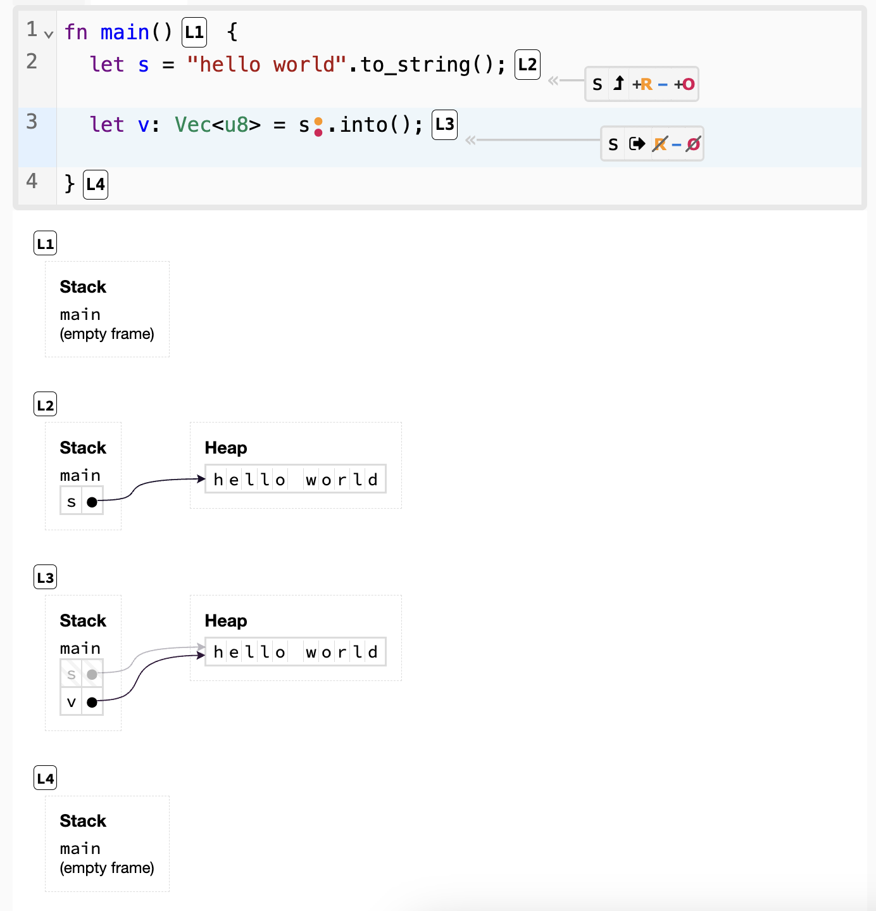
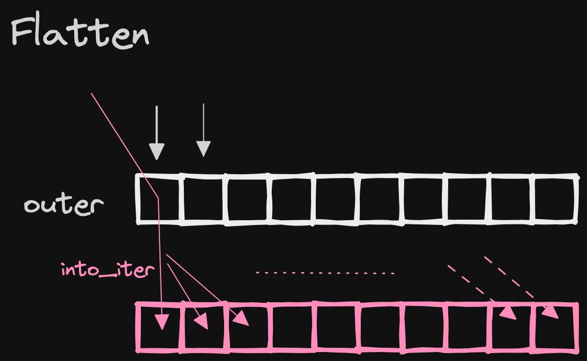
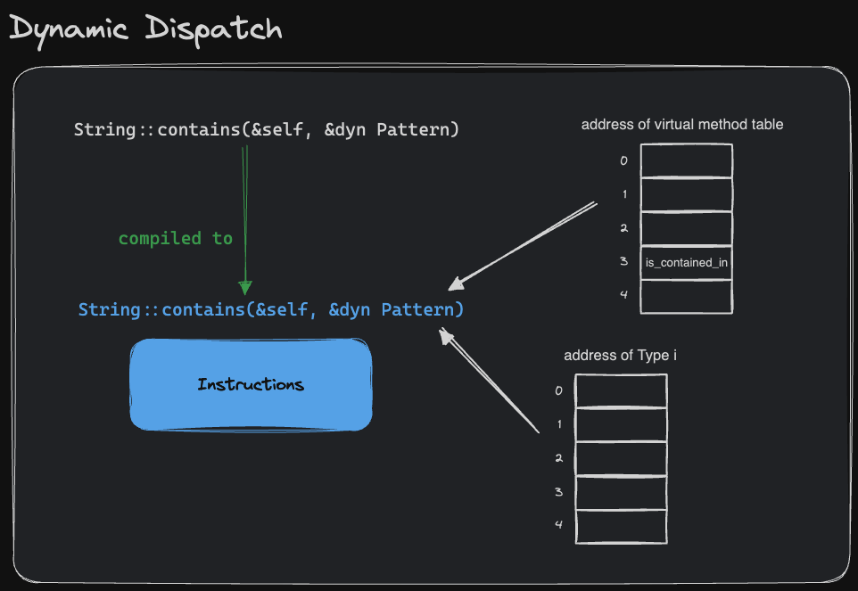

# Rust Note

- **Command-Line Rust** by Ken Youens-Clark: https://www.oreilly.com/library/view/command-line-rust/9781098109424/ 
- **Crust of Rust** by Jon Gjengset: https://www.youtube.com/playlist?list=PLqbS7AVVErFiWDOAVrPt7aYmnuuOLYvOa
- **The Little Book of Rust Macros**: https://github.com/veykril/tlborm

### `str` vs `&str` vs `String`

- `str -> [char]`, `str` is a sequence of chars, it doesn't know the size.
- `&str -> &[char]`, `&str` is a reference to a sequence of chars, so it knows both the start and the size of that char sequence.
- `String -> Vec<char>`, `String` is heap allocated where `&str` can be pointed to something on the stack or the heap.

If I have a `String`, going to a `&str` is trivial, it's cheap(AsRef).

Going the other way is harder, `&str -> String`, it's expensive(memcpy).

ref: https://www.youtube.com/watch?v=rAl-9HwD858&list=PLqbS7AVVErFiWDOAVrPt7aYmnuuOLYvOa&index=2

### Indexing a String in ASCII

Since every ASCII byte is one `u8` long, we could convert the `String` into `Vec<u8>`.

```rs
let s = "hello world".to_string();
let v: Vec<u8> = s.into();
println!("{}", v[0]); // b'h'
println!("{}", v[4]); // b'o'
```



### Use `as_bytes()` to iterate slice of ASCII bytes 

Performance Hint

All the inputs and outputs are in ASCII. Rust `String`s and `&str` are utf8, so while one might expect `"Hello".chars()` to be simple, it actually has to check each char to see if it's 1, 2, 3 or 4 `u8`s long. If we know a `&str` is ASCII then we can call .`as_bytes()` and refer to the underlying data as a `&[u8]` (byte slice). Iterating over a slice of ASCII bytes is much quicker as there are no codepoints involved - every ASCII byte is one `u8` long.

### cheat for compile fail test

```rs
/// ```compile_fail
/// let x: Vec<u32> = vecmac::avec![42; "foo"];
/// ```
#[allow(dead_code)]
struct CompileFailTest;
```
ref: https://doc.rust-lang.org/rustdoc/write-documentation/documentation-tests.html#attributes

### iterators

High level overview

```rs
fn main() {
    let mut iter = vec!["a", "b", "c"].into_iter();
    while let Some(e) = iter.next() {}
}
```

### why not generic?

Use a associated type make it easier to use a iterator because we don't have to specify the type for iterator.

```rs
// prefer this
trait Iterator {
    type Item;
    fn next(&mut self) -> Option<Self::Item>;
}

// don't prefer this
trait Iterator<Item> {
    fn next(&mut self) -> Option<Item>;
}
```

### iterator only do borrowing

```rs
fn main() {
    let vs = vec![1, 2, 3];
    for v in vs {
        // consumes vs, owned v
    }
    for v in vs.iter() {
        // borrows vs, & to v
    }
    for v in &vs {
        // equivalent to vs.iter()
    }
}
```

### flatten



### scoped threads can borrow non-`'static` data

- [Function std::thread::scope](https://doc.rust-lang.org/std/thread/fn.scope.html)
- [parallel letter frequency](./exercism/parallel-letter-frequency/)

### Static Dispatch and Dynamic Dispatch

```rs
impl String {
    // static dispatch
    pub fn contains(&self, p: impl Pattern) -> bool {
        p.is_contained_in(self);
    }
}
```

A copy of the `String::contains` method is made for every distinct pattern type. So compiler knows which address to dispatch to. This process is called **Monomorphization**, and it's part of the reason generic Rust code usually performs as well as non-generic code.


Note that **Monomorphization** also comes at a cost like slower compile time, larger program size and less effective for CPU's instruction cache. We can leaves only the type-dependent code for the compiler to copy for us while allowing the helper function to be shared.

```rs
impl String {
    // dynamic dispatch
    pub fn contains(&self, p: &dyn Pattern) -> bool {
        p.is_contained_in(&*self);
    }
}
```

Our program doesn't know which address to jump to in order to call the trait method `is_contained_in` on the given pattern. The caller must give callee both the `address of the pattern` and the `virtual method table`.



A combination of a type that implements a trait and its vtable is known as a **trait object**.